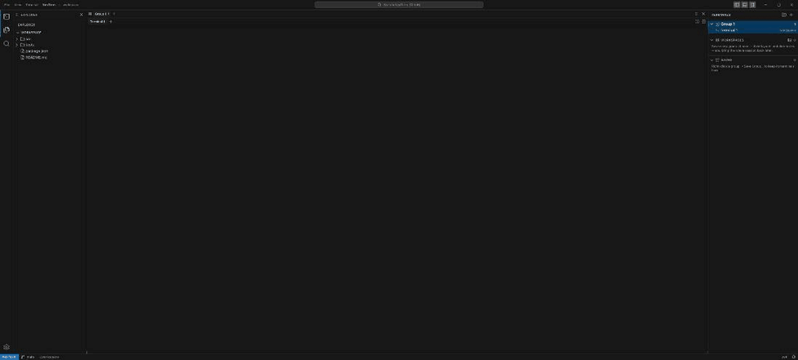

# NexTerm

A desktop terminal workspace with a VS Code shell and Warp-style terminal
ergonomics. Native [Tauri 2](https://tauri.app) window, real PTYs, React 18 UI —
macOS, Windows and Linux from one codebase.



> Two groups — `app` and `tests` — each with their own arrangement; switching
> between them, saving the whole session, and putting it back after it was taken
> apart. This is the Windows chrome (NexTerm draws its own title bar there);
> macOS keeps its traffic lights and the system menu bar.
>
> The recording is driven through the app's UI in a browser preview, so the shell
> output in it is simulated. In the packaged desktop app the same panes run real
> `zsh` / `bash` / `pwsh` / `cmd` processes.

## Why

Terminal multiplexing usually means memorising tmux bindings, and web-based
"AI terminals" cannot reach your local shell at all. NexTerm gives you a real
local PTY per pane with a layout you rearrange by dragging, and it remembers
that layout the next time you open it.

## What it does

- **A group is a whole screen.** Each group owns its own arrangement of panes,
  and the active one fills the terminal area. Click another group and its
  arrangement replaces it — the terminals you left behind keep running. Think
  of it as several desks rather than one crowded one.
- **Split panes by dragging a tab.** Drop a terminal tab on the left, right, top
  or bottom quarter of any pane to split there; drop it in the middle to move it
  into that pane. Splits nest arbitrarily and every divider is draggable, and
  where you drag a divider is where it stays — across a group switch and across
  a restart.
- **Move terminals between groups.** Drag a tab onto another group's chip, or
  use *Move to Group* in the TERMINALS panel.
- **Save a group, or the whole desk.** *Save Group…* keeps one group's layout
  and each terminal's current directory. *Save All Groups…* snapshots every
  group at once under a name, and restoring it brings the entire session back —
  same groups, same arrangements, same directories.
- **Session restore.** Groups, layouts, names and each terminal's `cwd` are
  written to local storage and restored on next launch, without being asked.
- **A real terminal.** xterm.js over a native PTY, with OSC 133 shell
  integration (command start/end + exit status) and OSC 7 so the status bar and
  new splits follow the shell's actual working directory. Terminals draw with
  xterm's WebGL renderer, so block and box-drawing characters — TUI logos,
  borders — fill their cells at any line height, and fall back to the DOM
  renderer where WebGL is unavailable.
- **Built for Windows' ConPTY.** The backend answers ConPTY's start-up cursor
  query (without it `cmd.exe` shows no prompt), and tells xterm.js the Windows
  build so a pane that is resized — a split, a maximised window — is not
  re-wrapped twice and does not lose lines.
- **Command suggestions.** An inline, oh-my-zsh-style ghost-text suggestion as
  you type, ranked from the commands this session has run plus a curated index
  of common ones. It is an app-side layer, not real shell completion — it never
  reads `PATH` or the filesystem.
- **11 terminal themes.** Dark Modern, Light Modern, Monokai, Material, Dracula,
  Solarized Dark/Light, Nord, One Dark, Gruvbox Dark, Tomorrow Night.
- **An editor when you need one.** Open a file from the Explorer and it appears
  as a Monaco tab above the terminals; close it and you are back to a pure
  terminal window. Monaco is loaded the first time the editor is shown, not at
  launch, and it and its workers are bundled locally — nothing is fetched from a
  CDN at runtime.
- **Opens with no folder, like VS Code.** NexTerm starts with nothing open;
  the Explorer offers *Open Folder*. Until a folder is open, terminals start in
  your home directory.
- **Filesystem confinement.** Every file command is resolved against the open
  folder, with the deepest existing ancestor canonicalised so symlinks cannot
  escape it. With no folder open, file commands are refused outright.
- **One title row.** On Windows and Linux the window is frameless and NexTerm
  draws its own compact title bar — a ☰ application menu, the folder name,
  command centre, layout toggles and window buttons in a single 35px row, VS
  Code style, instead of a native title bar with a native menu bar under it.
  macOS keeps its traffic lights and the system menu bar.

## Install

Grab a build from the [Releases](../../releases) page:

| Platform | File | Notes |
| --- | --- | --- |
| macOS (Apple Silicon) | `NexTerm_<version>_aarch64.dmg` | Unsigned — first launch needs right-click → Open, or `xattr -dr com.apple.quarantine /Applications/NexTerm.app` |
| Windows — installer | `NexTerm_<version>_x64-setup.exe` / `_x64_en-US.msi` | Installs WebView2 if missing (needs internet on first run) |
| Windows — portable | `NexTerm-windows-x64-portable.zip` | Unzip and run `NexTerm.exe`, no installation |
| Linux (x86_64) | `.AppImage` / `.deb` / `.rpm` | Built on Ubuntu 22.04 |

There is no Intel macOS build yet — CI runs on `macos-latest`, which is Apple
Silicon. Build one locally with `npm run tauri build -- --target x86_64-apple-darwin`.

## Using it

The recording above walks through most of this.

**Open a folder.** NexTerm starts with no folder. Click *Open Folder* in the
Explorer, or ☰ → File → *Open Folder…*. The Explorer, the title bar and new
terminals then follow that folder.

**Be told when something finishes.** A command that runs for more than ten
seconds in a terminal you are NOT looking at puts an entry in the status bar's
bell — name, exit code, how long it took — and clicking it takes you to that
terminal. Nothing is said about a command you watched finish, and nothing is
said about a quick one; the threshold is Settings ▸ Terminal ▸ Notify After,
and 0 turns it off.

**Search across the files.** `⇧⌘F`, or the magnifying glass in the activity
bar, opens a search over the open folder — match case, whole word, regular
expressions — grouped by file, and clicking a result opens that file with the
caret on the line. It skips exactly what the Explorer skips (`node_modules`,
`.git`, `target`, `dist`), so the results and the tree agree about what is in
the project; `.gitignore` itself is not read. Searching happens on `Enter`, not
on every keystroke: a grep of a real repository is not something to fire on the
`e` of `error`.

**Narrow the Explorer.** The funnel in the Explorer header opens a filter: type
part of a name and the tree keeps only what matches, plus the folders that lead
to it, opened. It counts the matches, `Esc` clears it, and clearing puts your
own expanded folders back exactly as they were. This is a different question
from ⌘P — "what is in here that looks like X, and where does it sit".

**Go back to a folder you had open.** `⌥⌘O`, File → *Open Recent…*, or the
list the Explorer shows when nothing is open. A folder that has since been
moved or deleted is refused by the backend and drops out of the list rather
than staying as a row that fails every time it is clicked.
**Pick a shell per terminal.** Right-click a group in the TERMINALS panel →
*New Terminal With ▸* lists the shells this machine actually has — found on the
real box rather than guessed, so it names Git Bash and WSL when they are there
and does not offer PowerShell 7 when they are not. Terminals in one window may
differ, the status bar names the one you are looking at, and *Duplicate* keeps
a terminal's shell as well as its directory. Settings ▸ Terminal ▸ Default
Shell picks what a plain new terminal opens, and still takes a typed path.

**Open a terminal.** The window starts as one group holding one terminal.
`⌃⇧\`` adds a tab to the current group; the `+` in the tab bar does the same.

**Split.** Use the split buttons in the panel header, `⌘D` (right) / `⌘⇧D`
(down), or drag a tab onto an edge of any pane. While dragging, the target
quarter lights up so you can see where it will land before you let go.

**Work in groups.** The chips above the terminals are your groups; `+` makes a
new one. Clicking a chip swaps the whole arrangement to that group's. Set up
one group for the app and another for tests, and switch between them instead of
cramming both onto one screen.

**Move a terminal to another group.** Drag its tab onto the target group's chip,
or right-click it in the TERMINALS panel → *Move to Group*.

**Click what the output names.** A stack trace's `src/app.js:42:13`, a
compiler's `--> src/main.rs:10:5`, a Python traceback's `File "x.py", line 9` —
click it and the file opens in the editor above with the caret on that line.
Relative paths are read against the terminal's current directory, not the
workspace root, so a `cargo` run inside `src-tauri/` lands on the right file.
`http://` and `https://` addresses open in your browser; nothing else is ever
offered as a link, and a path without a line number is left as plain text so
ordinary output does not fill up with underlines.
**See what the other terminals are doing.** A tab shows a blue dot while a
command is running in it and a red one when the last command failed, and a
group's chip shows the same for every terminal inside it. The point is the ones
you are not looking at: switching groups replaces the whole arrangement, so
without this a build finishing — or failing — in another group is invisible.
Hovering says it in words. Nothing flashes for an empty prompt line.
**Know which command you are scrolled into.** Scroll back through a long build
and a small header appears at the top of the pane naming the command whose
output you are looking at. It is gone at the bottom, where the header would
only repeat what is on screen, and never appears over a full-screen program
like vim or htop. Settings ▸ Terminal ▸ *Sticky Command Header* turns it off —
it covers the top row, which is occasionally the row you scrolled up to read.
**Run something again.** `⌘⇧H` opens the command history: every command line
this machine has run, newest first, with the directory it ran in. Typing
narrows it by plain substring — a command line is not a filename — and `Enter`
types the chosen one into the active terminal without pressing return, so a
command from yesterday can be edited before it runs. The history outlives the
window. It is **not** on `Ctrl+R`: that is reverse-i-search in every shell, and
a history palette that costs you the shell's own is a bad trade.

**Find something in the scrollback.** `⌘F` opens a find bar over the focused
terminal — incremental as you type, `Enter` / `Shift+Enter` to walk the matches,
`Esc` to close. Match case, whole word and regular expressions are there, every
match is highlighted at once, and the bar counts them ("3 of 17"). The buffer is
5000 lines deep by default, so this is how you get back to the error that
scrolled past.

**Make the text bigger.** `⌘=` and `⌘-` step the terminal and editor font
together, `⌘0` puts them back. While the size is not the default, the status bar
says so and clicking it resets.

**Rename.** Double-click a terminal tab, or right-click it → *Rename*. Groups
rename the same way, from their chip or from the TERMINALS panel.

**Save a group.** Right-click a group in the TERMINALS panel → *Save Group…*.
It lands under SAVED with its terminal count and age; right-click it to *Load
in New Group* or *Load into Current Group*.

**Save the whole session.** The 💾 on the WORKSPACES section (or *Save All
Groups…* from the empty-area menu) snapshots every group — layouts and
directories included. Double-click a saved workspace to put the session back
the way it was, or right-click → *Add Its Groups to This Session* to bring them
in alongside what you already have.

**Open a file.** Click a file in the Explorer. The Monaco editor opens above the
terminal panel as a normal tab; the terminals keep running underneath.

**Use the menu.** On Windows and Linux, ☰ at the left of the title bar opens
File, View and Terminal. Hover or use the arrow keys to step into a menu,
`Enter` to run an item, `Esc` to back out; keys typed while it is open never
reach the terminal behind it.

**See what git sees.** When the open folder is a repository, the status bar
carries the branch, how far it is from upstream and how many files have
changed, and the Explorer colours the ones that have — modified, added,
deleted, untracked — with a letter beside each, so the row still says something
where the colours do not. It shells out to your own `git`, which is what makes
worktrees, submodules and your own `core.*` behave here the way they behave in
the terminal below. There is no staging or committing: that is a second
application, and this one has git in it already.

**Change settings.** The gear in the activity bar opens a VS Code-style settings
window — editor font, terminal font/size/line-height, cursor style and blinking,
scrollback, colour theme, and command suggestions.

### Keyboard shortcuts

| Shortcut | Action |
| --- | --- |
| `⌘K` | Command palette |
| `⌘P` / `⌘⇧P` | Go to file / all commands |
| `⌘⇧F` | Search across files |
| `⌘⇧O` | Open a folder |
| `⌥⌘O` | Open a recent folder |
| `⌘,` | Settings |
| `⌃\`` | Toggle the terminal panel |
| `⌃⇧\`` | New terminal tab in the current group |
| `⌘D` / `⌘⇧D` | Split the active pane right / down |
| `⌘W` | Close the active terminal pane |
| `⌘⇧W` | Close the window |
| `⌥⌘←` / `⌥⌘→` | Focus the previous / next pane |
| `⌘B` | Toggle the primary sidebar |
| `⌥⌘B` | Toggle the terminals side bar |
| `⌘L` | Clear the active terminal |
| `⌘F` | Find in the active terminal's scrollback |
| `⌘⇧H` | Command history |
| `⌘=` / `⌘-` / `⌘0` | Bigger / smaller / default text |
| `⌘S` | Save the active editor file |

On Windows and Linux use `Ctrl` wherever `⌘` is listed. That is the table out
of the box — every row is rebindable.

**Changing a shortcut.** Settings ▸ Keyboard Shortcuts lists every command,
records the chord you press, and unbinds or resets one per row. Conflicts are
reported rather than resolved: two commands on one chord is called out, not
silently decided by which came first. What you change follows through to the
menus — the native menu bar on macOS and the ☰ menu on Windows and Linux both
print the key that actually runs the command, and the command palette shows it
too.

One thing rebinding will not do is take a control character away from the
shell. Bind something to `Ctrl+D` and the command runs from the keyboard, but
no menu item registers it as an accelerator — the window resolves its
accelerators before the terminal ever sees the key, so registering `Ctrl+D`
would cost every pane in the app its EOF. The menu shows that row without a
shortcut.

**Shortcuts yield to the shell, with a few exceptions.** A chord the terminal
needs goes to the terminal: with a pane focused, `Ctrl+D` is EOF, `Ctrl+K`
kills to end of line, `Ctrl+C` interrupts, `Ctrl+R` is reverse-i-search, and
the app does nothing. The same chord elsewhere in the window does what the
table says.

The exceptions are the shortcuts that would be useless if they stopped working
whenever a terminal had focus — which is this app's resting state. The app
claims these ahead of xterm:

- the side-bar toggles, `⌘B` / `Ctrl+B` and `⌥⌘B` / `Ctrl+Alt+B`; otherwise
  xterm turned `Ctrl+B` into `^B` and the shortcut the menu advertises did
  nothing at all
- find, `⌘F` / `Ctrl+F`
- the zoom keys, which are punctuation and a digit and cost the shell nothing

VS Code makes the same trades with the same keys. Two of them do take something
away on Windows and Linux, where `⌘` is `Ctrl`: **`Ctrl+B` will not reach tmux**
(rebind tmux's prefix, or rebind the toggle) and **`Ctrl+F` no longer moves the
cursor forward in readline** (the arrow keys still do). Both rows are rebindable
in Settings ▸ Keyboard Shortcuts. On macOS nothing is given up — `⌘` never
reaches the pty. Everything else in the table above is left to the shell.

Packaged builds also refuse the reload chords (`F5`, `Ctrl+Shift+R`, `⌘R`).
Reloading restarts the frontend, and start-up reaps every terminal the backend
is holding, so a stray reload would kill every running shell. Development
builds still reload, because that is the point of them.

## Develop

```sh
npm install
npm run tauri dev        # native window, hot-reloaded frontend
npm run dev              # frontend only, in a browser, on :1420
```

## Build

```sh
npm run tauri build
```

CI (`.github/workflows/build.yml`) runs the test suite on every push and builds
macOS, Windows and Linux bundles. Publishing is a separate, tag-only job:
pushing a `v*` tag creates the release as a **draft**, checks that all eight
expected assets are present and non-empty, uploads them, reads them back from
the API to confirm the sizes match, and only then makes the release visible.
A build that loses a platform leaves a draft behind instead of a half-finished
public release.

CI runs the tests on all three platforms, not just Linux. That matters because
the Rust suite spawns real shells, opens real PTYs and reads real directories,
so it behaves differently on each: ConPTY is not a unix pty, and
`C:\Users\me\project\src` is not a path that any `/`-shaped assumption
survives. The Windows job also reads the PE header of the binary it just built
and refuses anything that would open a console window beside the app.

## Test

```sh
cd src-tauri && cargo test    # PTY, ConPTY start-up, OSC parsing, fs confinement, native menu
cd ..
node tests/e2e/runner.js      # store + UI flows against a mock IPC bridge
node tests/adversarial/runner.js
```

Run `cargo test` **first**: it reads a real directory tree and writes what the
backend returned to `tests/fixtures/backend-tree.json`, which the adversarial
suite then pushes through the real explorer code. That pair is how a Windows
path is checked against the explorer on Windows rather than against a
hand-written string. Without the fixture those cases report as `SKIPPED`
rather than passing, so a run that checked nothing cannot look like a run that
checked everything.

## Verify on Windows

NexTerm is built on a Mac and used on Windows, and the suites cannot close
that gap on their own. Three consecutive releases fixed bugs that appear
**only on Windows**, and each shipped with every test on every platform
green — a title bar drawn twice, a folder dialog holding the event-loop
thread, a default shell that never reported its directory, a console window
flashing on every save. None of them returns an error; they are appearances,
and the code is correct on the machine that wrote it.

So a release is checked by hand on Windows, against a written list, with
evidence. [**WINDOWS_VERIFICATION.md**](WINDOWS_VERIFICATION.md) has the
procedure: the twelve checks, what each one is pinning and why it was not
caught, and the PowerShell helpers that make them evidence rather than
impressions — a screen capture (which works there and does not on the build
machine), the window's frame read as style bits rather than pixels, and a
`conhost.exe` count that catches a console flash too brief to see.

Two rules from it are worth repeating here, because both turn a real check
into a vacuous one:

- **Do not clear `%APPDATA%\com.nexterm.ide\.window-state.json` first.**
  Whether the app is right *with that file still in place* is exactly what is
  being checked; the fix was to stop reading the value so that nobody has to
  delete anything.
- **"Could not check" is a result.** The failure this guards against is a
  green report that nobody looked at, so a check that was not made is never
  written down as one that passed.

## How it fits together

```
src-tauri/src
  pty/            PTY manager, ConPTY start-up query, OSC 133/7 filter, shell integration
  fs/             folder-confined file commands + watcher
  menu.rs         native menu described as data, so it is testable off-thread
  commands/       the #[tauri::command] surface
src
  stores/         zustand stores (terminal tree, editor, settings, system info)
  components/     layout, terminal, editor, explorer, command palette
  lib/            persistence, paths, terminal compatibility rules, themes, IPC wrapper
```

The terminal layout is a tree: every leaf is a *group* holding an ordered list of
tab ids, and every branch is a horizontal or vertical split. Dragging a tab
rewrites that tree, and `src/lib/persistence.js` versions it into local storage.

## License

MIT — see [LICENSE](LICENSE).
